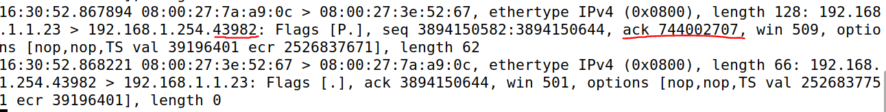

Instituto Superior Técnico, Universidade de Lisboa

**Network and Computer Security**

# Lab guide: Traffic analysis and TCP/IP Vulnerabilities

This lab guide focuses on traffic analysis to reveal TCP/IP vulnerabilities.
It also introduces various network analysis tools.

## Goals

- Gather information about the machines in the network;
- Explore some of the vulnerabilities of TCP/IP;
- Learn about _tcpdump_, _Wireshark_, _nmap_, _scapy_, _packit_ and _OpenVAS_ tools.

## 0. Setup

For this assignment you will need the 2nd and 3rd machines (VM2 and VM3) you created earlier.
You will _also need to create a 4th machine_ (henceforth called VM4) and put it in the same network as machine VM2 and VM3.
Simply cloning VM3 and changing its static IP to `192.168.1.4` should be enough.
After cloning, you should generate a new MAC address (on VirtualBox VM settings) for that machine, before starting the new VM.
Remember to run:

```sh
$ sudo systemctl restart NetworkManager
```

_Notes:_

- It is assumed that VM2 is `192.168.1.254` and VM3 is `192.168.1.1`;
- If you need to change the hostname and name resolution, change it in files `/etc/hostname` and `/etc/hosts`;
- Most commands used throughout this tutorial use `sudo`.
- If there are repeated MAC addresses, use the following command in the machine where you want to change the MAC address, for the adapter that is repeated:

```sh
$ sudo /sbin/ip link set eth0 address 00:00:00:00:00:11
```

## 1. Listening to the network

We will experiment with three tools: _tcpdump_, _Wireshark_ and _nmap_.

### 1.1. Tcpdump

The program _tcpdump_ allows you to listen to the local network (`$ man tcpdump` for more information).
If needed, select "Allow All" in the advanced section of the network settings for promiscuous mode in Virtual Box, for the VM that you want to use to capture traffic.
Run tcpdump in VM2 and detect the packet ICMP (using `ping -c 1`) from VM3 to VM4.
To identify the header, the IP address, the MAC address and the protocol in use:

```sh
$ sudo tcpdump -i eth1 -X -XX dst host <IP destination>
```

- 1.1.1. Keeping tcpdump running, start a telnet connection between VM3 and VM4.
Read the username and password of the user.
Observe that username and password appear letter by letter in different packets.  

```sh
$ telnet <IP destination>
```

- 1.1.2. Keep tcpdump running and start a __ssh connection__ between VM3 and VM4. 
Observe that it is not possible to read the username or password.

```sh
$ ssh <IP destination>
```

If you need to install `ssh-server` in VM4 run:

```sh
$ sudo apt install openssh-server
```

### 1.2. Wireshark

The program wireshark has a similar functionality to that of tcpdump but provides a graphical user interface.

- 1.2.1. In VM2 run wireshark in command prompt.

```sh
$ sudo wireshark
```

- 1.2.2. If you do not select the capturing interace when you start, go to the Capture -> Options menu;

- 1.2.3. Choose interface enp0s8 (or the one being used to communicate);

- 1.2.4. Select:
  - Update list of packets in real time
  - Automatic scrolling in live capture

- 1.2.5. Click start a new live capture;

- 1.2.6. Observe the network packets while executing (from VM3 to VM4 for example):
  - a) `ping`
  - b) `telnet`
    - i. See the IP and Ethernet headers.
    - ii. In the analyze menu do follow tcp stream to observe both the username and password.
  - c) `ssh`

Question: Why can you not see the credentials of SSH when using tcpdump or wireshark?

Sugestion: Look in Wireshark -> Analyze -> Follow -> TCP Stream (on a packet from the Telnet connection) to look at the traffic with a nicer presentation.

### 1.3. Nmap

Nmap is an open-source tool designed for network exploration and security auditing.
Be aware that unauthorized use of nmap on other people's networks can be a criminal offense.

The nmap tool provides information from remote machines (`$ man nmap` for more information).
To install it run:

```sh
$ sudo apt install nmap
```

- 1.3.1. To obtain the open ports from a remote machine run:

```sh
$ nmap <IP from remote machine>
```

- 1.3.2. To obtain the operating system from a remote machine run:

```sh
$ nmap -O <IP from remote machine>
```

If you get a dnet error, run the following command first:

```sh
$ sudo snap connnect nmap:network-control
```

## 2. Vulnerabilities in TCP/IP

In this section we will experiment with ARP redirect, RST hijacking, and redirect ICMP response.

### 2.1. ARP redirect

The ARP table (`$ man arp` for more information) maps IP addresses to MAC addresses.
It is possible to change this table to redirect packets to other machines.
This vulnerability is important in situations where we have a network with a switch, which makes it impossible to read packets addressed to other machines with tcpdump.
To change the ARP table of a remote machine do as follows:

- 2.1.1. Obtain the MAC addresses for all the machines of the sub-network.
For that you should ping from one machine, the other 2 machines, and run `arp -a`. For example, in VM2 do the following:

```sh
$ ping -c 1 192.168.1.1   # for VM3
$ ping -c 1 192.168.1.4   # for VM4
$ arp -a                  # To see the ARP table in the current machine
```

- 2.1.2. Validate that this table contains the correct MAC address of remote machine.
To find the MAC address of a machine run:

```sh
$ ifconfig
```

Machines with multiple interfaces have a different MAC address for each interface.
Make sure you check the correct one.

- 2.1.3. By consulting the ARP table it is possible to check if the MAC addresses are correct.
To change the ARP table in a machine, you can use the packit command (`man packit`):

```sh
$ sudo apt install packit
```
    
To change the ARP table of VM2, from VM3, run the following (in VM3):

```sh
$ sudo packit -t ARP -a 1 -x 192.168.1.4  -y 192.168.1.254 -Y <MAC of machine 192.168.1.254/VM2> -X <MAC of machine 192.168.1.1/VM3>
```

This command allows the injection of an ARP packet, and change the ARP table in VM2.
It tells VM2 (`-y` and `-Y` options) that the MAC address associated with IP `192.168.1.4` (VM4) is `<MAC of machine 192.168.1.1/VM3>` (respectively `-x` and `-X` options).

When VM2 receives this packet, it will assume that the MAC address of VM4 is the MAC address of VM3.
To observe these attacks, in VM2 do:

```sh
$ arp -a
```

before and after running the `packit` command above.
(To observe the MAC address in change you may need to temporarily disconnect VM4 from the internet, because it broadcasts this information correctly in regular intervals).

- 2.1.4. After changing the ARP table in VM2, run

```sh
$ sudo tcpdump -i enp0s3    # in VM3, or enp0s8 if enabled instead
$ sudo tcpdump -i enp0s3    # in VM4, or enp0s8 if enabled instead
```

and try to ping `192.168.1.4` from VM2.
Are these packets going to VM3 or VM4?

Notice that machines broadcast this information in regular intervals so this change is only temporary.
However, if this procedure is carried out at regular intervals (every second, for example) all traffic from the `192.168.1.254` machine (VM2) to the machine at `192.168.1.4` (VM4) is redirected to `192.168.1.1` (which is VM3).

If we do the same for `192.168.1.4` (changing the MAC address of VM2 to that of VM3) we can have VM3 receiving all packets between VM2 and VM4, and forward them after reading them.

### 2.2. RST Hijacking

The purpose of this attack is to _ReSeT_ a TCP connection.

- 2.2.1. On VM4, check the sequence number of acknowledge and the port used by VM2:

```sh
$ sudo tcpdump -S -n -e -l "tcp[13] & 16 == 16"
```

Bit 13 of the header indicates that the packet has the ACK (Acknowledge).

- 2.2.2. Set a telnet connection between VM2 and VM3.

- 2.2.3. Use scapy to send a packet of reset, from VM4 to one of the machines, using the correct sequence number:

```sh
$ scapy
>>> packet = IP(src='192.168.1.254', dst='192.168.1.1')/TCP(sport= <port>, dport=23, seq=<ack number>, flags='R')
>>> send(packet)
```

The following image shows an example of the last two packets received in the TCP dump in VM4 after the telnet login in VM2, and the correct port and ack number to use in the command above in this case.



- 2.2.4. Check if connection is closed.

    Question: From which machine are you expecting the `<port>` and `<ack number>` in the 2.2.3 command?

### 2.3. Redirect response to ICMP echo/request

This attack allows a ping response to be sent to a machine that did not make the request.

- 2.3.1. Run tcpdump on VM4 to spy the source and destination of the packets (recall that option -i selects the network interface).

```sh
$ sudo tcpdump "ip[9]=1"
```

- 2.3.2. Send a ICMP packet with a wrong source:

```sh
$ scapy
>> sr(IP(dst='192.168.1.254', src='<IP of a different machine>')/ICMP())
```

<!--
### 2.4 To learn more

If you want to learn more, there are more tasks available in the [SEED Labs Networking Labs](https://seedsecuritylabs.org/Labs_20.04/Networking/).

- Task 1: SYN Flooding Attack, and
- Task 4: TCP Session Hijacking.
-->

## 3 OpenVAS

OpenVAS is a vulnerability scanner tool, and it can perform a security analysis on a remote machine, by scanning for vulnerabilities.
In typical operation, OpenVAS begins by doing a port scan to determine which ports are open on the target and then tries various exploits on the open ports.

To install OpenVAS:

- Install docker on your host machine: https://docs.docker.com/engine/install/ubuntu/
- Grab the OpenVAS container from the docker registry and start it up: https://hub.docker.com/r/mikesplain/openvas

In the web browser, go to: `https://127.0.0.1`

Login using the following credentials:

- Username: admin
- Password: admin

Once you are in, go to Scans > Tasks and open the Task Wizard.

Fill the `IP Address or hostname` field with the IP of the machine you want to analyze.

In case you want to analyse VM2, for example, you should add a new network adapter and attach it to "Bridged Adapter", then, in the VM type 'hostname -I' to discover your IP address.

## 4 Conclusion

This lab guide offered a practical experience in network analysis, focusing on TCP/IP vulnerabilities using tools like tcpdump, Wireshark, and nmap.
It highlighted techniques such as ARP redirect for manipulating network traffic, RST hijacking to disrupt connections, and the Redirect response to ICMP echo/request attack, which involves sending a ping response to an unintended recipient.
To conclude, the guide introduced OpenVAS, a tool for vulnerability scanning.

----

[SIRS Faculty](mailto:meic-sirs@disciplinas.tecnico.ulisboa.pt)
